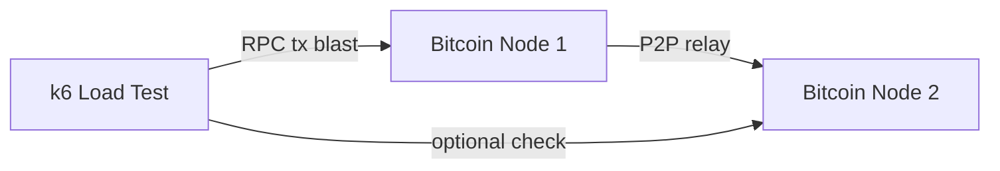

# bitload

### High-throughput Bitcoin Core load testing on `regtest`

<div class="mt-8 text-sm opacity-70">2 nodes • k6 • reproducible local setup</div>

<!--
~20s
Open with one sentence:
"Bitload is a local lab to stress Bitcoin Core safely, using regtest and k6."
-->

---
layout: center
---

# Why This Exists

- Identify the limits of Bitcoin
- Find bugs or errors when hitting these limits
- Public networks are noisy and expensive

<!--
~25s
Frame the pain: benchmarking in real networks mixes too many variables.
Bitload creates a controlled environment for performance experiments.
-->

---
layout: center
---

# What We Built



<div class="mt-6 text-sm opacity-70">Node 1 handles load • Node 2 verifies propagation</div>

<!--
~35s
Explain architecture quickly:
- k6 sends many sendtoaddress RPC calls to node 1
- node 2 is connected peer for relay observation
- optional propagation checks sample how fast txs arrive at node 2
-->

---
layout: center
---

# Tech Stack

- `Bitcoin Core` on `regtest`
- `k6` for load testing using js
- `devenv` + `Nix` for reproducible setup (no Docker)

<div class="mt-6 text-sm opacity-70">Simple local stack, production-grade testing patterns</div>

<!--
~25s
Keep this slide fast:
- Bitcoin Core gives realistic node behavior
- regtest keeps tests deterministic
- k6 drives controlled traffic load
- devenv/Nix makes setup consistent across machines
-->

---
layout: two-cols
---

# Run It

```bash
devenv shell
devenv up
k6 run script.js
```

::right::

# Default Test Shape

- ramp: `50 -> 2000 tx/s`
- duration: `~1.5 min`
- threshold: `>95% send success`

<!--
~45s
Left: workflow is intentionally 3 commands.
Right: mention ramping-arrival-rate scenario, preallocated VUs, and success/failure thresholds.
-->

---
layout: center
---

# What We Measure

- `send_success_rate`
- `http_req_failed`
- `propagation_latency` (optional)

<div class="mt-6 text-sm opacity-70">Plus node status reports for quick diagnosis</div>

<!--
~30s
Mention CHECK_PROPAGATION=1 enables latency metric to node 2.
Node status script helps correlate failures with node health.
-->

---
layout: center
class: text-center
---

# Value

### Safe stress tests
### Repeatable results
### Faster Bitcoin Core tuning

<!--
~20s
Close on impact before moving to concrete execution steps.
-->

---
layout: center
---

# Next Steps

- Run observability tools
- Run with nodes in different locations 
- Add more tests cases

<!--
~20s
Suggested variables: rpc threads, rpcworkqueue, TX amount, fee rate.
End with one sentence on turning this into a repeatable benchmark suite.
-->
